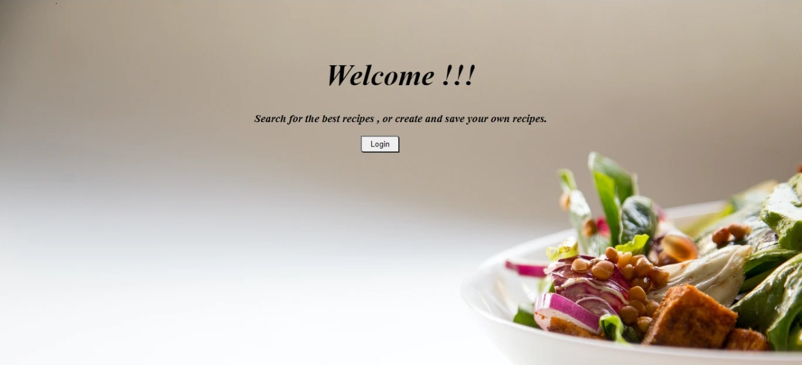
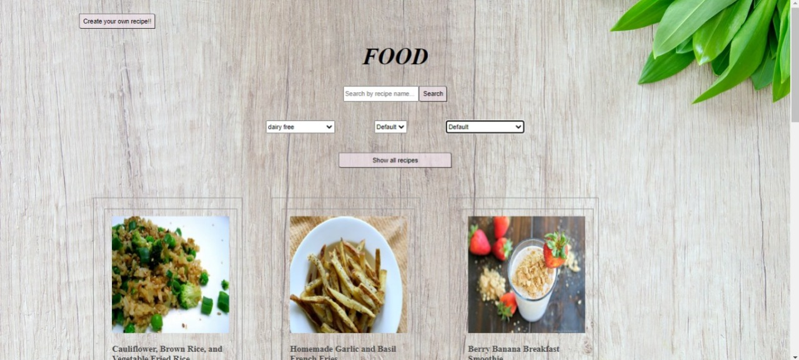
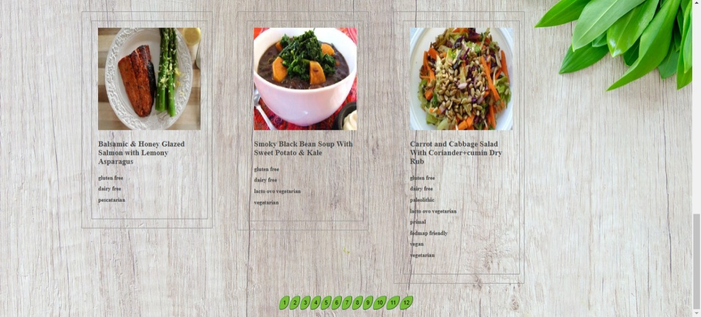
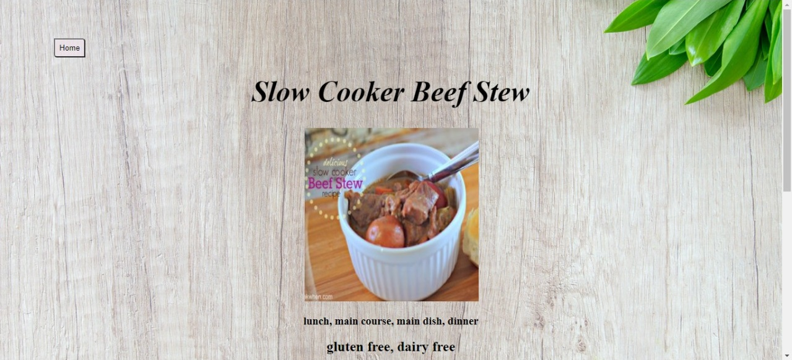
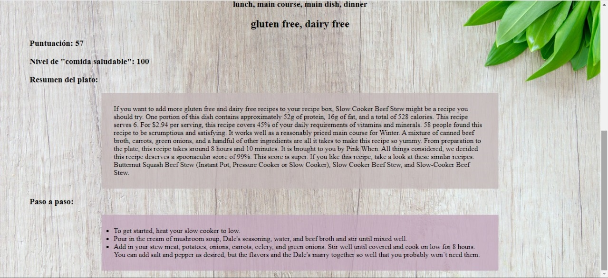
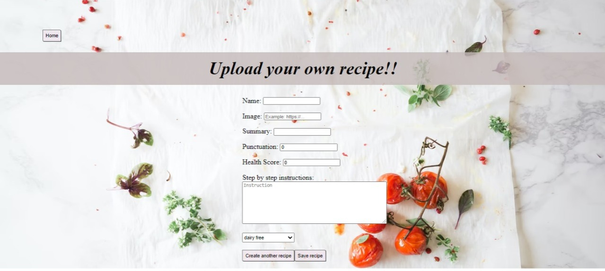

    

# Individual Project - Henry Food

## Objetivos del Proyecto

- Construir una App utlizando React, Redux, Node y Sequelize.
- Afirmar y conectar los conceptos aprendidos en la carrera.
- Aprender mejores prácticas.
- Aprender y practicar el workflow de GIT.
- Usar y practicar testing.

## Enunciado

La idea general es crear una aplicación en la cual se puedan ver distintas recetas de comida junto con información relevante de las mismas utilizando la api externa [spoonacular](https://spoonacular.com/food-api) y a partir de ella poder, entre otras cosas:

  - Buscar recetas
  - Filtrarlos / Ordenarlos
  - Crear nuevas recetas propias

#### Tecnologías utilizadas:

- [ ] React
- [ ] Redux
- [ ] Express
- [ ] Sequelize - Postgres

#### Testing

- [ ] Un componente del frontend con sus tests respectivos
- [ ] Una ruta del backend con sus tests respectivos
- [ ] Un modelo de la base de datos con sus tests respectivos

## Imagenes del proyecto
 
<h2 align="left">
🟨Landing Page
</h2>

  

 
<h2 align="left">
🟨Home
</h2>

  

 
<h2 align="left">
</h2>

  

 
<h2 align="left">
🟨Detalle de la receta
</h2>

  

 
<h2 align="left">
</h2>

  

 
<h2 align="left">
🟨Crear una receta
</h2>

  

 
<h2 align="left">

<h1>Muchas gracias por ver el proyecto 😁👋</h1>
